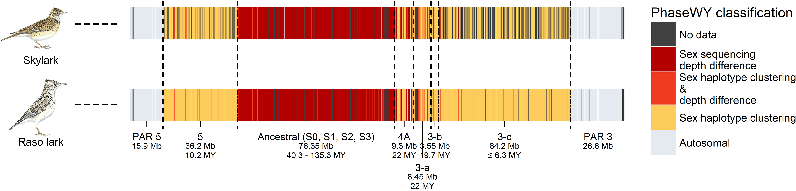
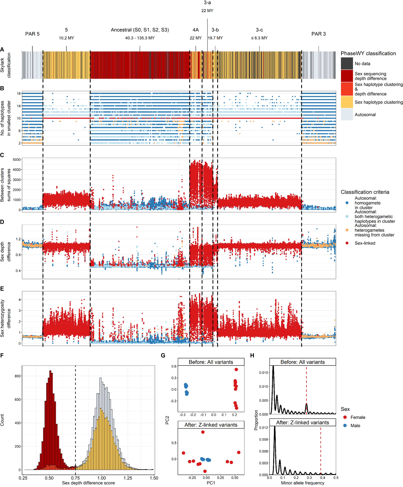

# PhaseWY version 2026-03-16

[](https://doi.org/10.5281/zenodo.19050140)

PhaseWY is an automated Snakemake pipeline that uses whole-genome sequencing data from multiple female and male individuals to identify sex-chromosomal regions and extract the corresponding Y/W sequences. PhaseWY (i) detects sex differences in alignment depth, (ii) applies read-based and statistical haplotype phasing, (iii) identifies sex-linked regions using haplotype clustering, and (iv) subsets autosomal, X/Z- and Y/W-linked variants for downstream analyses.


#### Citation
If you use PhaseWY in your research, please cite our pre-print at bioRxiv:  
**Ellerstrand JE., Churcher A., Kutschera VE., Hansson B. 2026. *PhaseWY: A pipeline for haplotype phasing, sex chromosome identification and extraction of sex-limited sequences*. bioRxiv.**

#### Documentation
Refer to the [documentation](https://github.com/sjellerstrand/Snakemake_PhaseWY/blob/main/documents/PhaseWY_2026-03-17_documentation.pdf) for detailed description of each pipeline step.

#### Example data
An example dataset is available at [zendo](https://doi.org/10.5281/zenodo.19050140).



## Pipeline overview
This is a Snakemake version of the PhaseWY pipeline written in Snakemake 8. Miniconda3 has been installed in the project directory on Dardel in order to be able to run Snakemake with conda.

The code for the pipeline has been split into ten separate Snakefiles (e.g. step1.smk, step2.smk...) files in the 'workflow/rules/' directory. These files are called by the main Snakefile and correspond to the original steps 1-10 bash scripts (e.g. PhaseWY_Step1-10.sh scripts). For the first few steps of the pipeline (e.g. steps 1-3), some parts are organized slightly differently than the original code.  

In order to run the pipeline, the **'config/config.yaml'** file must be modified with the project-specific settings and paths. The compute project will also need to be added to the **'slurm/config.yaml'** file along with any additional resource adjustments. The instructions for this can be found below.

## Setting up the 'config/config.yaml' file
The 'config.yaml' file contains paths to relevant input files required by the pipeline. It also contains filtering and run parameters that should be set by the user. Descriptions of the required input is included below.

#### Project name
The project name will be used to name the top folder in the results and intermediate folder hierarchies. This allows the user to run several projects within the same snakemake folder. Note that the top folder name will further contain the sex depth threshold and the whatshap setting. Within each project folder, some steps will further be divided by haplotype cluster parameters to allow the user to explore several settigns in parallel.
```
project: "Rasolark_test"
```

#### List of contigs to include
The path to a text file that contains the list of contigs to include in the analyis should be provided (contig_list). If the applied file matches the reference index file, all contigs will be included in the reference.
```
contig_list: "config/contig_list.txt"
```
The text file should look like this:
```
CADDXX010000058.1
CADDXX010000069.1
CADDXX010000137.1
```

#### Sample info file
Here, the path to a tab separated file should be provided. It should include sample name, average dept, sex (HETGAM=XY/ZW, HOMGAM=XX/ZZ), ploidy (2 is the only option, and must be set for the pipeline to run), and path to the corresponding bam-file. Note that the samples should have been aligned to a reference assembly without Y/W contigs, since the method relies on Y/W sequences being aligned to the homologous X/Z. Also, the bam-files @RG header should contain the SM-tag of the corresponding sample name.
```
sample_table: "config/samples_all.tsv"
```
The 'tsv' file should look like the example below. Note that column headers need to be in the same format
```
sample_name depth   sex ploidy  bamfile
TT95871 34.8395 HETGAM  2   example/TT95871.bam
TT95873 26.9165 HOMGAM  2   example/TT95873.bam
...
```
Per-sample mean depth can easily be calculated with vcftools based on variants in the input vcf: 
```
vcftools --gzvcf example/ Rasolark_variants.vcf.gz --depth --out Rasolark_variants
```

#### Reference files
The paths to the input vcf, genome assembly, and mask (optional) files should be specified in 'config/config.yaml' file. For example:
```
input_vcf: "example/Rasolark_variants.vcf.gz" 
genome: "example/Rasolark_2021_consensus_reference.fasta"
mask: "example/Rasolark_masked_repeats.bed" 
```
The **mask** file should be given in bed format. Here is an example from a 'repeats.bed' file of how these files should look:
```
CADDXX010000001.1	1468	1602
CADDXX010000001.1	2487	2521
CADDXX010000001.1	5104	5111
```

#### Clump small contigs
Some steps are run per contig. For fragmented genomes, 
all contigs shorter than a specified length can be
clumped into the same job. The length is specified in Mb
```
clump_max_len: 1 # Mb
```

#### Filtering paramters for callable sites
The **min_dp** parameter should be set with and interger value at the minimum depth at an individual site for it to be kept. The **min_mean** and **max_mean** parameters are the min and max mean depth required for a site to be kept (accepts float values). The **missing** is the cutoff for missing data. These can be set according to filtering parameters used during vcf filtering. It will be applied to identify callable but non-variable sites, but can filter sites listed in the vcf as well.
```
min_dp: 5 
min_mean: 7.457
max_mean: 46.41
missing: 0.95
```

#### Set thershold for determining sex linkage due to sex differences
When Y/W sequences have completely degenerated, the normalized sex depth of heterogametes should be close to 0.5, while autosomal regions should be close to 1. The **sex_depth_threshold** can be set to a threshold value to determine wether a site is sex-linekd or not. Everything below the set threshold will be determined as sex-linked, and no Y/W sequences will be extracted for mthose regions.
```
sex_depth_threshold: 0.75
```

#### Set percentage of variants to subsample for depth distribution plot
Sampling every site in the genome will both be computer heavy and redundant. Here it is possible adjust the percentage of sites to randomly subsample for distribution plots. A higher percentage can be set if only a specific chromosome is being analysed, while a whole genome might require a lower percentage to avoid memory limitations.
```
subsample=0.01
```

#### Toggle read-based phasing with WhatHap
WHatsHap is the most demanding step of the pipeline, but perhaphs the most important for phasing of singletons and successful phasing of small datasets. However, WhatsHap can be disabled by setting the following option to "OFF". Anything else will default to "ON"
```
disable_whatshap: "OFF"
```

#### Haplotype clustering parameters (Step 6: sex linkage)
Here specific parameter settings can be set for haplotype clustering. Everything prodiced from this step will be stored in a parameter dependent folder to enable parameter exploration.
```
# Haplotype clustering parameters (Step 6: sex-linkage)
mac: 1                # Minor allele count to filter for haplotype clustering
window: 10000         # Number of sites used per window for haplotype clustering
step: 2500            # Number of sites for each sliding window step for haplotype clustering
dist_model: "Inverse_MAF" # Hamming distance is default. Can also be set as "Inverse_MAF" to give rare alleles higher weight.
```

#### Specify output vcfs for statistics
Here, the output vcfs for which statistics should be calculated should be specified below (Step 10). The names of the results_vcfs should not be altered as they correspond to files produced by earlier pipeline steps. Instead, comment out the names on this list where statistics are not needed. For example:
```
results_vcf:
 - phased_all_variants
 - autosomal
 - sexlimited
 - sexshared
 - autosomal_filtered
 - sexlimited_filtered
 - sexshared_filtered
 - nonphased_variants 
 - border_variants
 #- all_inds_ILS1_not_hetgam_dropout
 #- sexshared_ILS1_not_hetgam_dropout
 #- sexlimited_ILS1_not_hetgam_dropout
 #- all_inds_ILS2
 #- unreliable_variants/sexshared_ILS2
 #- sexlimited_ILS2
 #- heterogametic_sexlinked_singletons
 - all_unreliable_sites
```

#### Specify path to syntenic reference genome for lift over and genome summary plot (will only run if file exists)
ref_species: "Aarv" # only used for naming synteny species folder
synteny_species: #"Pmaj" # only used for naming synteny species folder
synteny_genome: #"example/Parus_major/GCF_001522545.3_Parus_major1.1_genomic.fasta"

#### Specify plotting parameters for genome summary plot
```
width: 15000
height: 800
min_len: 1 # Mb
```

## Setting up the 'slurm/config.yaml'
All of the Snakemake and slurm configurations are stored in the slurm profile in `slurm/config.yaml`. This includes resource allocation (e.g. threads, memory, time limits) and the compute project account for which the user has access.  To get started, the slurm account should be provided in the **slurm_account:** field. For example:
```
slurm_account: naiss2024-XX-XXX
```
The slurm/config.yaml file includes settings for each rule. The thread and memory allocations in particular may need to be adjusted for larger projects.


## How to run the pipeline using the slurm profile
Snakemake can be installed using conda and the environment file `environment_Snakemake_PhaseWY.yaml`:
```
conda env create -f environment_Snakemake_PhaseWY.yaml
```

Create a new tmux or screen session. Then activate the encironment from within the tmux or screen session (conda environments created by Snakemake are placed in `.snakemake/conda/`):
```
conda activate Snakemake_PhaseWY
```

## Run the pipeline
The pipeline is run from within the main snakemake folder, since all paths within the pipeline are relative:

```
# Dry run
snakemake -s workflow/PhaseWY --profile slurm --configfile config/config.yaml -n

# Main run
snakemake -s workflow/PhaseWY --profile slurm --configfile config/config.yaml

# Only callable regions
snakemake -s workflow/PhaseWY --profile slurm --configfile config/config.yaml --until cat_regions

# Only callable regions and sex-depth differences
snakemake -s workflow/PhaseWY --profile slurm --configfile config/config.yaml --until cat_regions cat_htgm_dropout

# Only phasing
snakemake -s workflow/PhaseWY --profile slurm --configfile config/config.yaml --until merge_phased_marker_vcfs

# Make rulegraph
snakemake -s workflow/PhaseWY --profile slurm --configfile config/config.yaml --dag | dot -Tsvg > DAG.svg
```

## Run the companion python script to extract Y/W sequences
We provide phasing_female_male_pair.py, a companion python script that take a single female-male pair and output the heterogamete as two haploid sequeces, one putative X/Z and one putative Y/W. This phasing is applied to all variants provided in the vcf. Therefore, this script is only appropriate to apply to known sex-linked regions. To run the script, provide a vcf file (-i; gzipped or non-zipped) with one female and one male. The first individual should be the heterogamete, and the second the homogamete. The supplit the output file (-o). Not that the script does not output a gzipped file:
```
python3 companion_scripts/phasing_female_male_pair.py -i female_male_pair.vcf.gz -o female_male_pair_phased.vcf
bgzip female_male_pair_phased.vcf
tabix female_male_pair_phased.vcf.gz
```
